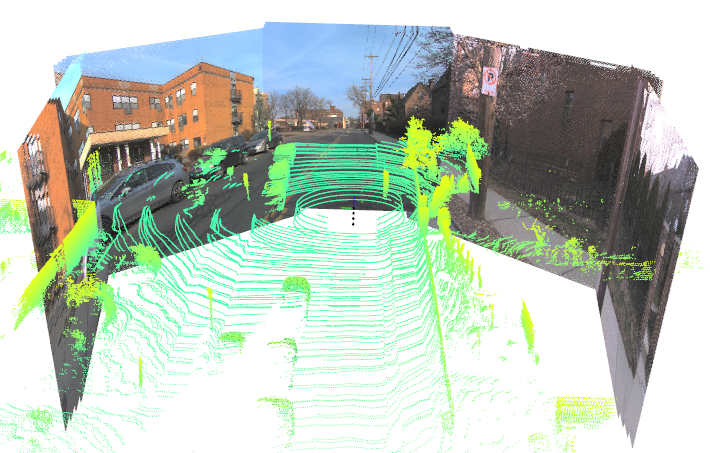

# Bucketed Scene Flow Evaluation

This repo provides the official implementation of _Bucket Normalized EPE_, as described in our paper [_I Can't Believe It's Not Scene Flow!_](https://vedder.io/trackflow.html)

This repo provides:
 - A speed and class aware evaluation protocol called _Bucket Normalized EPE_. See our [paper](https://vedder.io/trackflow.html) for more details.
 - A standardized interface for working with Scene Flow datasets.
 - Evaulation infrastructure for the [Argoverse 2 2024 Scene Flow Challenge](https://eval.ai/web/challenges/challenge-page/2210/overview).

Currently supported datasets:

 - Argoverse 2 (Human Labeled and [NSFP Pseudolabeled](https://github.com/kylevedder/BucketedSceneFlowEval/blob/master/docs/GETTING_STARTED.md#argoverse-2-nsfp-pseudolabels-new))
 - Waymo Open (LiDAR only)
 - NuScenes (LiDAR only, beta)


If you use this repository as part of a publication, please cite:

```
@misc{khatri2024trackflow,
    author = {Khatri, Ishan and Vedder, Kyle and Peri, Neehar and Ramanan, Deva and Hays, James},
    title = {I Can't Believe It's Not Scene Flow!},
    journal = {arXiv},
    eprint = {2403.04739},
    year = {2024},
    pdf = {https://arxiv.org/abs/2403.04739}
}
```

## Installation

```
pip install bucketed-scene-flow-eval
```

## Setup

Follow our [Getting Started](docs/GETTING_STARTED.md) for setup instructions.

## Demo

We provide a demo script which shows off the various features of the API.

### Argoverse 2:

To render the lidar and multiple camera views of an Argoverse 2 sequence in 3D, run:

```
python scripts/demo_3d.py --dataset Argoverse2CausalSceneFlow --root_dir /efs/argoverse2/val/ --with_rgb --sequence_length 4
```



To render RGB frames with lidar imposed on top, run:

```
python scripts/demo_rgb.py --dataset Argoverse2SceneFlow --mode project_lidar  --reduction_factor 16 --root_dir /efs/argoverse2/val --sequence_length 150 --save_dir /efs/av2_camera_render/
```


To render the flow field of an Argoverse 2 sequence, run:

```
python scripts/demo_rgb.py --dataset Argoverse2SceneFlow --mode project_flow  --reduction_factor 16 --root_dir /efs/argoverse2/val --sequence_length 150 --save_dir /efs/av2_camera_render/ --flow_dir <path to method flow output>
```


### Waymo Open:

```
python scripts/demo.py --dataset WaymoOpenSceneFlow --root_dir /efs/waymo_open_processed_flow/validation/
```

## Evaluating AV2 flow submissions

To evaluate an AV2 Scene Flow challenge entry named `./submission_val.zip` against validation dataset masks `/efs/argoverse2/val_official_masks.zip`, run

```
python scripts/av2_eval.py /efs/argoverse2/val /efs/argoverse2/val_official_masks.zip ./submission_val.zip
```

## Documentation

See `docs/` for more documentation .
